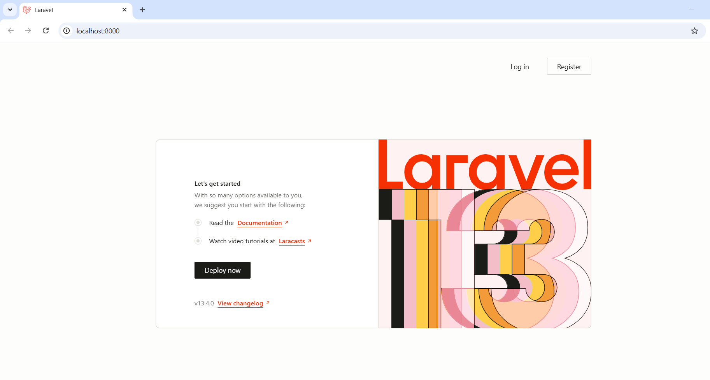
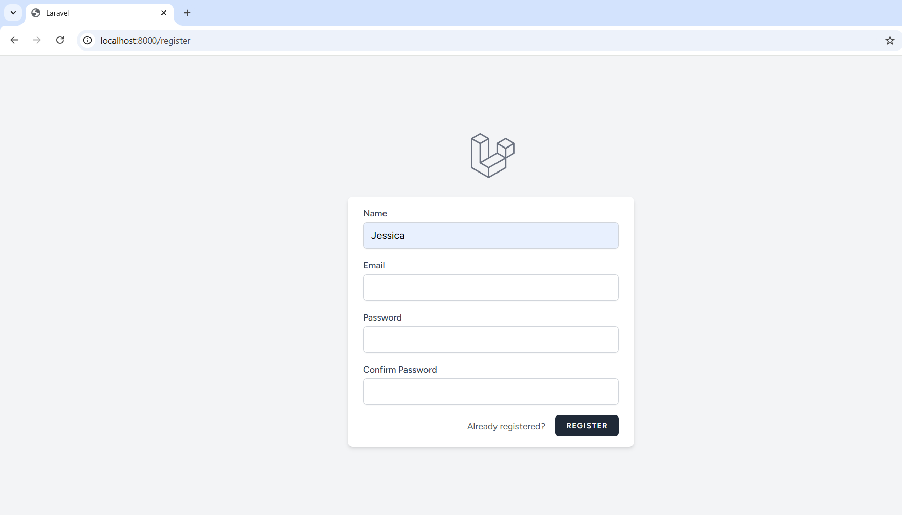
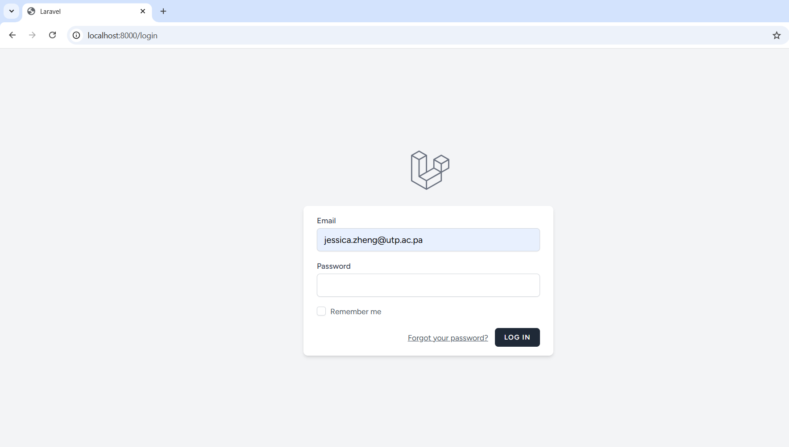
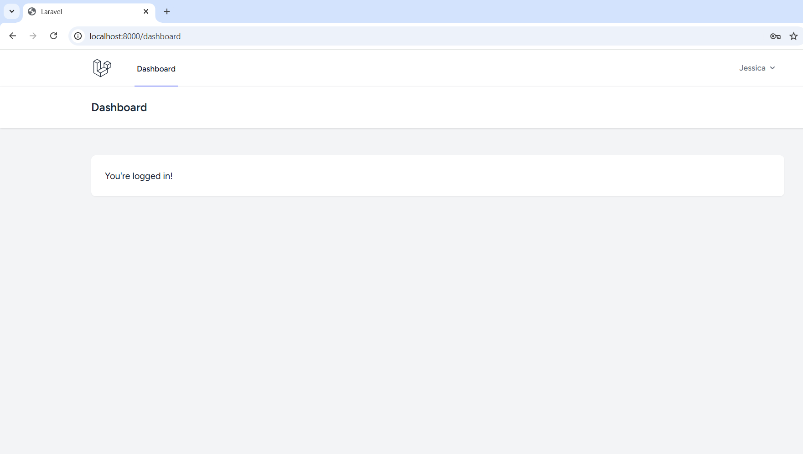

# Laboratorio Laravel
Se documenta el laboratorio de Laravel, incluyendo los requisitos previos, los códigos implementados y los resultados obtenidos en la ejecución del laboratorio.

## Objetivos del laboratorio
- Comprender la importancia de la documentación en proyectos de desarrollo de software.
- Consolidar el aprendizaje de la arquitectura Modelo-Vista-Controlador (MVC) en Laravel.
- Evidenciar el proceso de configuración e implementación del módulo de login en Laravel.
- Identificar las dificultades encontradas durante el laboratorio y las soluciones aplicadas.
- Generar un repositorio académico organizado, que sirva de referencia para futuras prácticas.

---

## 1. Requisitos Previos

### Prerrequisitos (ecosistema de desarrollo del laboratorio)
- PHP versión 8.0 o superior
- Última versión estable de Composer
- Laravel Installer o crear proyecto con laravel new / composer create-project
- Paquete de servidor web local como XAMPP, WampServer o Laragon (Entorno de desarrollo)
- Servidor web: Apache o Nginx
- Base de datos MySQL/MariaDB funcionando
- Editor de código (Visual Studio Code recomendado)
- Sistema operativo (Windows)

<p align="center">
  
  
  
  
  
</p>

A continuación se muestra el flujo de comandos utilizados para crear el proyecto e instalar las dependencias:

### Instalación de Laravel y creación del proyecto
```bash
composer global require laravel/installer
```

```bash
laravel new PruebaRegistroLaravel
```


### Instalación de dependencias
```bash
composer update
```

```bash
npm install
```

#### Laravel Breeze (autenticación)
```bash
composer require laravel/breeze --dev
```

```bash
php artisan breeze:install
```

---

## 2. Introducción
Laravel es un framework basado en el patrón de arquitectura MVC (Modelo-Vista-Controlador), el cual convierte el desarrollo de aplicaciones complejas en un proceso más manejable al organizar los proyectos en capas separadas.

Cada carpeta tiene su función en torno a la arquitectura MVC, las cuales se detallan a continuación:  

### Modelos
Representan la lógica de negocio y la interacción con la base de datos. Se encuentran en la carpeta app/Models y se encargan de gestionar los datos de la aplicación.

### Controladores
Se ubican en app/Http/Controllers y manejan la lógica de la aplicación. Reciben las solicitudes del usuario, procesan la información y devuelven una respuesta.

### Vistas
Ubicadas en resources/views, representan la interfaz visual de la aplicación utilizando el motor de plantillas Blade.

### Rutas
Definidas en la carpeta routes/ (principalmente web.php), permiten asignar URLs a controladores o funciones específicas.

### Comando utilizado para la migración
```bash
php artisan migrate
```

---

## 3. Resultados
<p align="center">
   
  
  
  
</p>

---

## 4. Base de Datos
### Base de datos y entorno
El laboratorio utiliza como gestor de base de datos MySQL mediante el framework Laravel, la cual permite interactuar con la base de datos de forma estructurada a través de migraciones y configuración del archivo .env.

### Entornos de base de datos (.env)
La configuración de la base de datos se realiza en el archivo .env, el cual define los parámetros de conexión del sistema. En este archivo se establecen datos como:

- Nombre de la base de datos (DB_DATABASE)
- Usuario (DB_USERNAME)
- Contraseña (DB_PASSWORD)
- Host (DB_HOST)

Estos valores permiten que la aplicación se conecte correctamente al motor de base de datos.

### Aspectos de Laravel
Las migraciones en Laravel permiten crear, modificar y versionar la estructura de la base de datos mediante código, lo que facilita el control del esquema sin necesidad de ejecutar consultas SQL manuales.

Cada migración define la creación de tablas como usuarios, sesiones y otras estructuras necesarias para el funcionamiento del sistema. Estas migraciones pueden ejecutarse mediante el comando:

```bash
php artisan migrate
```

---

## 5. Dificultades y Soluciones
El primer problema al que me enfrenté durante este laboratorio fue la instalación de Composer, ya que durante el proceso me mostraba un error de certificados (OpenSSL failed with a 'certificate verify failed'). Este error se debía a que el antivirus Norton bloqueaba la instalación al considerarlo un archivo sospechoso, por lo que lo solucioné desactivando temporalmente “Safe Web” de Norton.

Otro problema que tuve fue "Table migrations doesn't exist in engine", el cual solucioné eliminando todas las tablas de la base de datos, las creé nuevamente con el mismo nombre y luego corrí el comando "php artisan migrate" nuevamente.

---

## 6. Referencias
- [Cómo instalar Composer en Windows](https://www.youtube.com/watch?v=yp04wvbAJPs)
- [Composer Installer Error](https://github.com/composer/composer/issues/12336)
- [Table migrations doesn't exist in engine](https://stackoverflow.com/questions/67999350/table-project-migrations-doesnt-exist-in-engine-mysql)
- Diapositivas del curso

---

## 7. Footer
Este laboratorio ha sido desarrollado por el estudiante de la Universidad Tecnológica de Panamá:

Nombre: Jessica Zheng 8-1033-370

Correo: jessica.zheng@utp.ac.pa

Curso: Desarrollo de Software VII

Instructor del Laboratorio: Irina Fong

Fecha de ejecución: 08/04/2026